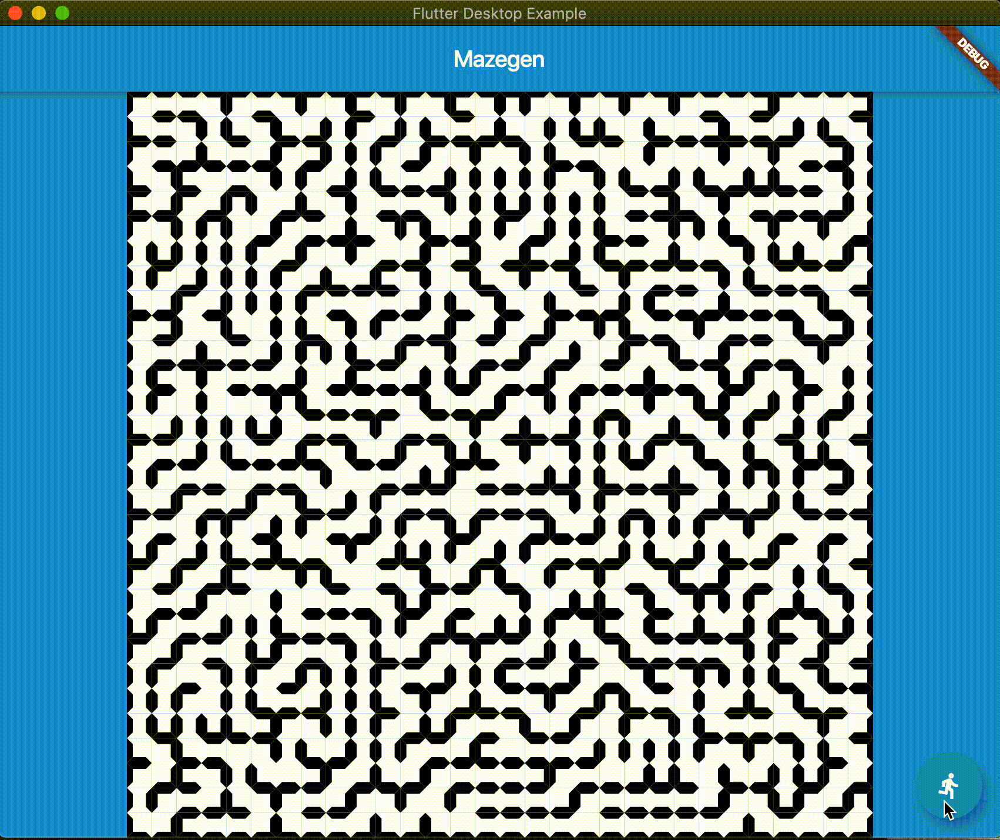

# Flutter Mazegen

Flutter Mazegen is a project to generate mazes in Flutter.

After [Bob's dungeon generator post](https://journal.stuffwithstuff.com/2014/12/21/rooms-and-mazes/) appeared on my "news" feed (only 5 years later : ), I was inspired to dust off some old C++ code and make it run on Flutter. It should work on Windows, Mac, Android, iOS and [web](https://csells.github.io/flutter_mazegen/gh_pages/index.html).

Enjoy!

## Usage

```shell
$ flutter packages get
$ flutter run -d <Android device>|<iOS device>|windows|macos|chrome
```

## Demo
Click [here](https://csells.github.io/flutter_mazegen/gh_pages/index.html) to run app in your browser right now!

